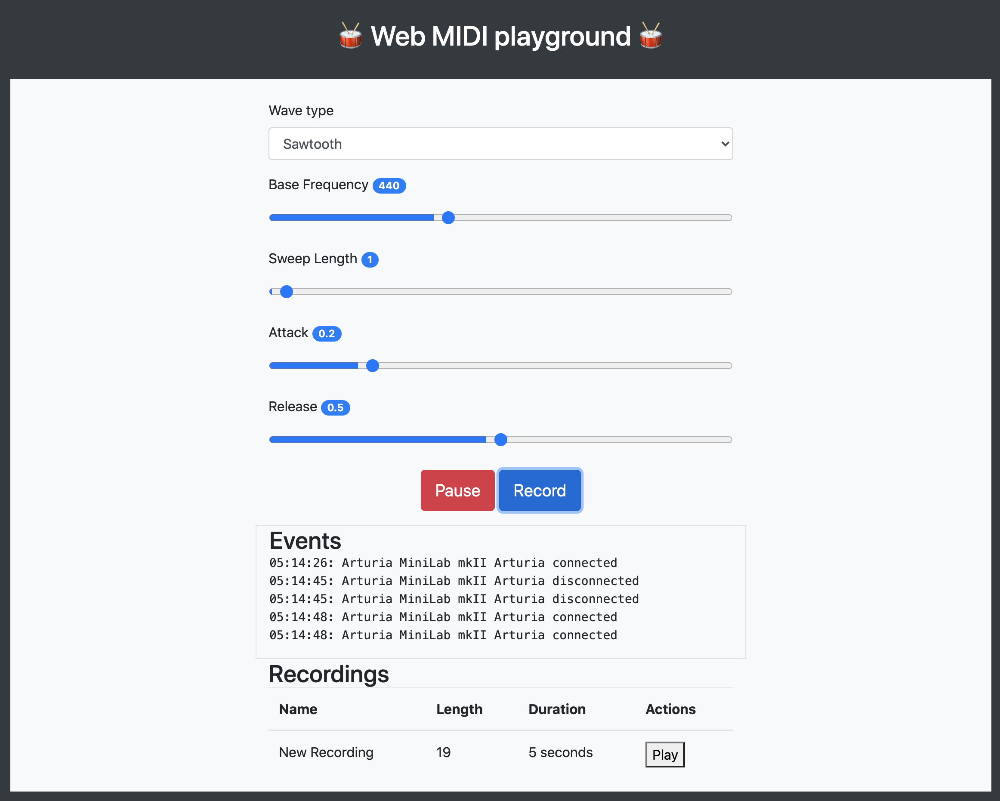

# Web MIDI Playground

A web app that can be used to experiement with [MIDI keyboards](https://en.wikipedia.org/wiki/MIDI_keyboard). Developed using the [Web MIDI](https://developer.mozilla.org/en-US/docs/Web/API/MIDIAccess) and [Web Audio](https://developer.mozilla.org/en-US/docs/Web/API/Web_Audio_API) APIs. 

[Web MIDI API](https://developer.mozilla.org/en-US/docs/Web/API/MIDIAccess) has [very limited browser support](https://developer.mozilla.org/en-US/docs/Web/API/MIDIAccess#Browser_compatibility) at the moment and works only in the latest versions of Google Chrome / Microsoft Edge.

